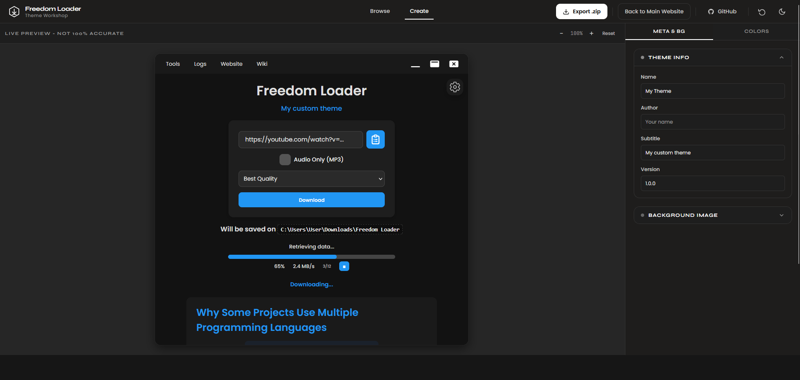

# Freedom Loader Theme Workshop

Theme editor for Freedom Loader - part of the [Freedom Loader](https://github.com/MasterAcnolo/Freedom-Loader) project.

Visit the main website: https://masteracnolo.github.io/FreedomLoader/

## What is this?

The Theme Workshop is a visual editor for creating custom themes for Freedom Loader. No coding required.

- Browse existing community themes: index.html
- Create your own theme: create.html

## Creating a Theme

1. Open create.html in your browser
2. Customize colors using the color picker
3. Adjust fonts, sizing, and layout in the settings panel
4. Preview changes in real-time
5. Click "Export .zip" to download

The exported ZIP contains:
- theme.json (your theme configuration)
- preview.png (theme preview)

## Installing a Theme

Extract your theme ZIP and place the folder in:
`%AppData%\FreedomLoader\Themes\`

Restart Freedom Loader and select your theme from Settings > Appearance.

## Submitting Your Theme

To share your theme with the community:

1. Export your theme as ZIP
2. Create a GitHub issue on the main project: https://github.com/MasterAcnolo/Freedom-Loader/issues
3. Attach your theme ZIP and preview image

## Project Links

- Main Project: https://github.com/MasterAcnolo/Freedom-Loader
- Main Website: https://masteracnolo.github.io/FreedomLoader/
- Theme Browse: index.html
- Theme Creator: create.html

## Template

See [template.theme.json](https://github.com/MasterAcnolo/Freedom-Loader/blob/main/theme/template.theme.json) for the full spec.
